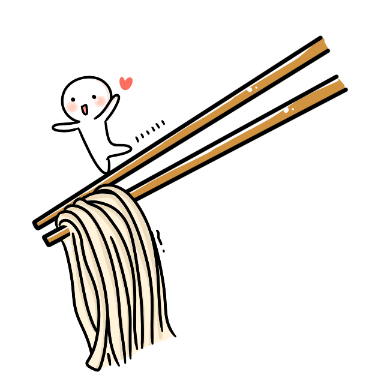

# chow

A framework for writing cross-platform, testable automation scripts.

[](https://circleci.com/gh/kharland/chow)
[](https://codecov.io/gh/kharland/chow)
[](http://godoc.org/github.com/kharland/chow)




## Overview
Chow helps you write complex cross-platform build scripts to test & deploy
software.

### Installation

```sh
go get -u go.kendal.io/chow
```

### Examples

#### Hello World

The following program calls the "echo" executable on the current PATH to print some text.

```go
package main

import "go.kendal.io/chow"

func main() {
    chow.Main(RunSteps)
}

func RunSteps(r chow.Runner) {
    r.Run("echo hello_world", chow.Step{
        Command: []string{"echo", "Hello, World!"},
    })
}
```

### Testing

Chow tests are written like normal go tests, and can be added alongside other
unit tests.  Example:

```go
package main

import (
    "testing"
    "go.kendal.io/chow"
)

func TestMain(t *testing.T) {
    cfg := chow.TestConfig{Runnable: RunSteps}
    
    t.Run("default", func(t *testing.T) {
        cfg.Run(chow.TestCase{})
    })
}
```

Outputs:

```json
[
    {
        "step_name": "echo hello_world",
        "step": {
            "command": [
                "echo",
                "Hello, World!"
            ],
            "outputs": null
        },
        "result": {
            "stdout": "",
            "stderr": "",
            "exit_code": 0
        }
    }
]
```

This JSON output is referred to as an *expectation*.  Expectations are normally
written to disk and checked into your source tree.  When the code changes, they
be should be regenerated and diffed to ensure that the set of commands exected
by the script was modified as expected.


For more examples see the [chow-examples] project.

For an more in-depth user guide, see the [Wiki]

[chow-examples]: https://github.com/kharland/chow-examples
[Wiki]: https://github.com/kharland/chow/wiki